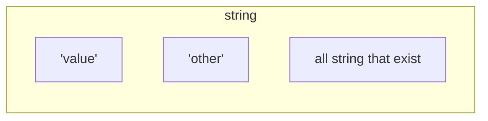

# Type Driven Design

### Introduction

## C'est quoi ?

Avec Duplojs


---

# Type Driven Design : **Signification**

<br/>
<br/>

### `Type Driven Design` === `conception guidée par le type`

<br/>
<br/>

En `Type Driven Design`, quand vous concevez un logiciel, avant de coder, en priorité vous devez typer !

<br/>
<br/>

## Mais **Type** !== **Type**

---

# Type Driven Design : **Typage machine**

<br/>
<br/>

Traditionnellement, lorsque l'on parle de **typage**, on pense directement au **type machine**. 

Et c'est normal ! Car, au départ, c'est pour les machines que ça a été créé :

```c
int main() {
    int age = 23;
    char name[] = "Mathieu";

    return 0;
}
```

Le **typage** a été inventé pour indiquer au compilateur comment bien stocker en mémoire une valeur.

```
int age = 23; -> 17 00 00 00
char name[] = "Mathieu"; -> 4D 61 74 68 69 65 75 00
```

### Mais l'utilisation du typage a vite été détournée !

---

# Type Driven Design : **Un allié de la conception**

<br/>

Un nouvel usage a vite été trouvé ! Certes, il permettait d'indiquer à la machine comment ranger une variable en mémoire, mais pour les développeurs le typage permet de réfléchir de manière plus **structurée**.

```ts
interface User {
    name: string
    age: string
}
```
Le **typage** prend ici une autre dimension. Il crée l'**identité** d'une **donnée** en nommant et regroupant plusieurs valeurs.

**TypeScript** est un exemple parfait : le **typage** n'a aucune utilité au runtime et n'est qu'un **outil** pendant le **développement**.

---

# Type Driven Design : **Le meilleur outil de développement**

L'**atout** principal du **typage**, c'est qu'il intervient lors de la phase de **développement**. 

Ce qui étaient avand des prérequis pour la cohérence de la mémoire deviennent aujourd'hui des **obligations** !

```ts twoslash
const value: string = "value";
declare function superFunction (input: number): void
superFunction(value);
```

Et les **obligations**/**types** étant des informations **explicites**, il est donc tout à fait possible de lancer un programme sans qu'il n'y ait d'**erreur**, car votre **compilateur** vous aurait averti en amont.

---
layout: center
---

# Finalement, on fait tous déjà un
# peu de `type driven design` ?

### Spoiler : Absolument pas !

---
layout: two-cols-header
---

# Type Driven Design : **C'est plus que ça**

On pourrait croire que le `type driven design` se résume à créer des **interfaces** et des **types** pour les `entrées` et `sorties` de nos méthodes/fonctions, afin que le `code métier` à l'intérieur puisse s'**exécuter** plus **sereinement** !

### Mais pour être sereins, il faudrait que le code exécuté à l'intérieur soit aussi contraint.

::left::
```ts
interface Order {
    id: string;
    createdAt: Date;
    state: "validated" | "inProgress";
    validateDate?: Date;
    paymentMethod?: string;
}

```
::right::
```ts twoslash
interface Order {
    id: string;
    createdAt: Date;
    state: "validated" | "inProgress";
    validateDate?: Date;
    paymentMethod?: string;
}
// ---cut---
function confirmOrder(order: Order): Order {
    return {
        id: order.id,
        createdAt: order.createdAt,
        state: "inProgress",
        paymentMethod: "trololo",
    };  
}
```
Avec une donnée mal pensée, c'est donc **impossible** d'être **serein**.

Il vous faudra **multiplier** les `tests unitaires` !

<style>
.two-cols-header {
  column-gap: 10px;
}
</style>

---
layout: two-cols-header
---

# Type Driven Design : **Sécurisation de la donnée**

En identifiant correctement les différents **états** de la **donnée**, il est donc impossible dans notre cas de se tromper !

::left::
```ts
interface InProgressOrder {
    id: string;
    createdAt: Date;
    state: "inProgress";
}

interface ValidatedOrder {
    id: string;
    createdAt: Date;
    state: "validated";
    validateDate: Date;
    paymentMethod: "bankTransfer" | "creditCard";
}
```
::right::
```ts twoslash
interface InProgressOrder {
    id: string;
    createdAt: Date;
    state: "inProgress";
}

interface ValidatedOrder {
    id: string;
    createdAt: Date;
    state: "validated";
    validateDate: Date;
    paymentMethod: "bankTransfer" | "creditCard";
}
// ---cut---
function confirmOrder(order: InProgressOrder): ValidatedOrder {
    return {
        id: order.id,
        createdAt: order.createdAt,
        state: "inProgress",
        paymentMethod: "trololo",
    };  
}

```

Là, on peut commencer à être serein !

<style>
.two-cols-header {
  column-gap: 10px;
}
</style>

---

# Type Driven Design : **Points essentiels**

La plupart des logiciels sont grosso modo des programmes qui font transiter de la donnée d'**état** en **état**.

Si vous arrivez à **identifier** tous les **états** et à **structurer** votre **donnée** afin qu'elle soit **discriminable** le plus **simplement** possible, le reste ne sera que de l'**implémentation** bête et méchante, impossible à rater !

```ts twoslash
interface InProgressOrder {
    id: string;
    createdAt: Date;
    state: "inProgress";
}

interface ValidatedOrder {
    id: string;
    createdAt: Date;
    state: "validated";
    validateDate: Date;
    paymentMethod: "bankTransfer" | "creditCard";
}
// ---cut---
type Order = InProgressOrder | ValidatedOrder;

declare const order: Order

if (order.state === "validated") {
    order
    // ^?
}
```

---

# Type Driven Design : **Créer des logiciels robustes**

<br/>

La **robustesse** est au cœur du `type driven design`. Ce typage fort peut paraître verbeux, mais à très court terme, lors de l'implémentation ou d'un changement, toute votre codebase va s'illuminer en **rouge** et c'est **génial** ! 

Votre code deviendra résistant aux erreurs qui pourraient se glisser lors de l'exécution et vous fera prendre en compte l'impact de chacun de vos choix. 

### Ah, merde, j'ai 100 erreurs, ou plutôt... Putain ! Il y a 100 impacts identifiés dans le code.

Il ne reste plus qu'à naviguer facilement pour réadapter tout le code concerné. 

*Il y a évidemment plein d'autres concepts à mettre en place pour que ce soit parfait, et je vous les présenterai dans d'autres cours !*

---

# Type Driven Design : **Quel langage utiliser ?**

<br/>

Tous les **langages** typés ne sont pas forcément **optimisés** pour le `type driven design`. Le langage doit obligatoirement avoir :
- Le support des unions types
- Le support des intersections
- Une catégorisation des types
- Un système de générique avancé

<br/>

## Le meilleur candidat pour mixer **robustesse** et **vélocité** est:
## **TypeScript** (accompagné de `Duplojs`)

---
layout: two-cols-header
---

# Type Driven Design : **Quel langage utiliser ?**
## Le support des union types

::left::
```ts twoslash
type MyType = (
    | {
        type: "one";
        test: string;
    }
    | {
        type: "two";
        superProp: true;
    } 
)

declare const value: MyType;

// @noErrors
value.
//    ^|
```

::right::
```ts twoslash
type MyType = (
    | {
        type: "one";
        test: string;
    }
    | {
        type: "two";
        superProp: true ;
    } 
)

declare const value: MyType;
// ---cut---
if(value.type === "one") {
    value;
    // ^?
}


```

Les deux objets à l'intérieur de l'union `MyType` ont comme **propriété** commune `type`, cela permet de facilement les **discriminer**, et c'est d'ailleurs la seule propriété disponible.

Après avoir **vérifié** que la **propriété** `type` était bien égale à `"one"`, le **typage** suit et la présence de la **propriété** `test` est confirmer.


<style>
.two-cols-header {
  column-gap: 10px;
}
</style>
---
layout: two-cols-header
---

# Type Driven Design : **Quel langage utiliser ?**
## Le support des intersections

::left::
```ts twoslash
type MyType = (
    & {
        type: "one";
        test: string;
    }
    & { superProp: true; } 
    & { value: number; }
)

declare const value: MyType;

// @noErrors
value.
//    ^|
```

::right::
Les trois **objets** à l'intérieur de `MyType` sont mis en **intersection**. Cela signifie que `MyType` représente les trois **objets** en même temps.

Ils sont maintenant **indissociables** et toutes les **propriétés** des **objets** sont **disponibles** sur `MyType`.

<style>
.two-cols-header {
  column-gap: 10px;
}
</style>

---

# Type Driven Design : **Quel langage utiliser ?**
## Une catégorisation des types

```ts twoslash
type MyType = "value" extends string ? true : false
//    ^?


type MyTypeSwitsh = string extends "value" ? true : false
//    ^?


type MySuperType = {p1: string} extends {p1: string, p2: boolean} ? true : false
//    ^?


```

Les **types** appartiennent à des **ensembles** reconnaissables, ce qui permet de les **manipuler**. Pour cela, TypeScript est basé sur la théorie des ensembles.


---
layout: two-cols-header
---

# Type Driven Design : **Quel langage utiliser ?**
## Un système de générique avancé

Les **génériques** permettent d'**inférer** des **arguments** de fonction et de les **manipuler**. Il est même possible de créer des **types** avec des **génériques** comme si c'était une fonction avec des arguments pour ensuite **calculer** des **types** plus **complexes**.

::left::
```ts twoslash
function toString<T extends number>(input: T): `${T}` {
    return `${input}`;
}

const result = toString(12);
//    ^?
```

::right::
```ts twoslash
type ToObject<T extends string> = {
    [Prop in T]: true
}

type MyType = ToObject<"superValue" | "test">
//   ^?
```

<style>
.two-cols-header {
  column-gap: 10px;
}
</style>
---
layout: two-cols-header
logo: false
---

# Type Driven Design : **Accompagné de Duplojs**

::left::
**TypeScript** propose un système de **typage** très **riche**, mais étant basé sur le langage **JavaScript**, il a beaucoup de **legacy** lié à celui-ci. C'est pour cela que **Duplojs** est venu corriger les fonctions de base et ajouter des éléments de **programmation fonctionnelle** qui n'existent pas dans le langage.

Il propose aussi des outils de **pattern matching**, de **discrimination**, de manipulation d'objets, tout ça de manière **100% typée**.

**Duplojs** est un **écosystème** très large qui couvre plusieurs problématiques, mais pour le `type driven design`, nous nous servirons exclusivement de la librairie `@duplojs/utils`.

::right::


---
layout: center
---

# Fin de l'introduction.
## Prochain chapitre : Typer l'intypable.